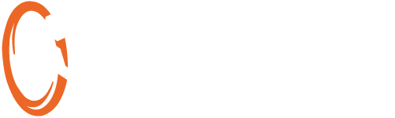

  

# Portal 2: Community Edition

Portal 2: Community Edition is a custom community made engine branch of Valve's Portal 2 made to bring more features to modders and mappers of the game.
P2:CE is built on top of [Strata Source](https://stratasource.org/), a community maintained fork of the CS:GO engine.

This GitHub repository is used as a task tracker and does not contain P2:CE's source code.  
For more information, visit [our website](https://www.portal2communityedition.com) or join our [Discord Server](https://p2ce.org/discord).

## Issue guidelines
Issues should..
- be a _singular_ task that can be _completed_ independently
- include all necessary information to understand the meaning without having to ask
- only regard the game P2:CE itself and not Portal 2 or other open source repositories. Open your issue there

General issues related to engine features and tools should be opened on the [Engine issue tracker](https://github.com/StrataSource/Engine).

## Other Repositories
* P2:CE's Hammer FGD, editor icons and more are found in the [FGD repository](https://github.com/StrataSource/FGD).
* Map instances can be found in the [P2CE-Instances repository](https://github.com/StrataSource/P2CE-Instances).
